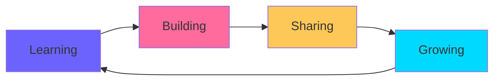

<div align="center">

# 💫 Welcome to Sura's Digital Space


[](https://www.instagram.com/ikis.sura)
[](https://wa.me/668885031354)
[](https://www.youtube.com/c/donghuasaga7636)
[](https://sura-api.vercel.app)


</div>

---

## 🚀 About Me


```javascript
const sura = {
    name: "Sura Ryzen",
    location: "Surabaya, Indonesia 🇮🇩",
    role: "Full Stack Developer",
    passions: ["Anime", "Gaming", "Music", "Coding"],
    hobbies: ["Tech Innovation", "Graphic Design", "Web Development"],
    currentFocus: "Building awesome web applications",
    funFact: "Listening to music while coding is my superpower! 🎵💻"
};
```

<br clear="right"/>

### 💭 What I Love
- 🎌 **Anime Enthusiast** - Always watching the latest series
- 🎮 **Gamer** - Playing with friends is my favorite pastime
- 🎵 **Music Lover** - Code + Music = Perfect Productivity
- 💻 **Tech Explorer** - Always learning new technologies

---

## 🛠️ Tech Stack & Tools

<div align="center">

### 👨‍💻 Languages & Frameworks


### 🎨 Design & Creative


### 🔧 Development Tools


</div>

---

## 📊 GitHub Statistics

<div align="center">


### 📈 Most Used Languages


### 🏆 GitHub Trophies


</div>

---

## 🎯 Current Projects & Goals

<div align="center">



</div>

- 🔭 Currently working on **Web Development Projects**
- 🌱 Learning **Advanced JavaScript & Modern Frameworks**
- 👯 Looking to collaborate on **Open Source Projects**
- 💬 Ask me about **Web Development, Design, or Anime!**
- ⚡ Fun fact: **I can code for hours if I have good music! 🎧**

---

## 📫 Let's Connect!

<div align="center">

<table>
<tr>
<td align="center" width="33%">

<br>
<strong>WhatsApp</strong>
<br>
<a href="https://wa.me/668885031354">Chat with me</a>
</td>
<td align="center" width="33%">

<br>
<strong>Instagram</strong>
<br>
<a href="https://www.instagram.com/ikis.sura">@ikis.sura</a>
</td>
<td align="center" width="33%">

<br>
<strong>YouTube</strong>
<br>
<a href="https://www.youtube.com/c/donghuasaga7636">Donghuasaga</a>
</td>
</tr>
</table>

### 💌 Feel free to reach out for collaborations or just a friendly chat!


</div>

---

<div align="center">

### 💝 Show some love by starring ⭐ some repositories!


</div>
