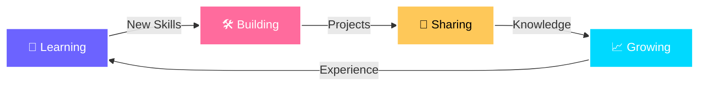

<div align="center">


<br>


<br><br>

[](https://www.instagram.com/ikis.sura)
[](https://wa.me/668885031354)
[](https://www.youtube.com/c/donghuasaga7636)
[](https://sura-api.vercel.app)

<br>


</div>

<br>


##  About Me


```typescript
class Developer {
  name: string = "Sura Ryzen";
  location: string = "Surabaya, Indonesia 🇮🇩";
  role: string = "Full Stack Developer";
  
  passions: string[] = [
    "Anime 🎌",
    "Gaming 🎮", 
    "Music 🎵",
    "Coding 💻"
  ];
  
  hobbies: string[] = [
    "Tech Innovation 🚀",
    "Graphic Design 🎨",
    "Web Development 🌐"
  ];
  
  currentFocus(): string {
    return "Building awesome web applications! 🔥";
  }
  
  funFact(): string {
    return "Music + Code = Superpower! 🎧💪";
  }
  
  getLife(): string {
    return "while(alive) { eat(); sleep(); code(); repeat(); }";
  }
}

const sura = new Developer();
console.log(sura.currentFocus());
```

<br clear="right"/>

<details>
<summary><b>🌟 Click to know more about me!</b></summary>
<br>

### 💭 What Drives Me

- 🎌 **Anime Enthusiast** → Always watching the latest & greatest series
- 🎮 **Pro Gamer** → Squad up with friends for epic gaming sessions  
- 🎵 **Music Addict** → Coding without music? Impossible!
- 💻 **Tech Explorer** → Forever learning, forever growing
- 🎨 **Creative Mind** → Design is not just what it looks like, it's how it works
- ⚡ **Quick Learner** → New tech? Challenge accepted!
- 🌐 **Community Builder** → Love sharing knowledge and helping others
- 🔥 **Passionate Coder** → Turning coffee into code since forever!

</details>

<br>


##  Tech Stack & Skills

<div align="center">

### 💻 Programming Languages


### 🚀 Frontend Development


### ⚙️ Backend Development


### 🎨 Design & Creative Tools


### 🔧 Tools & Platforms


</div>

<br>


##  GitHub Statistics

<div align="center">

<table>
<tr>
<td width="50%">

</td>
<td width="50%">

</td>
</tr>
</table>

<br>

### 📊 Contribution Activity


<br>

<table>
<tr>
<td width="50%">

### 📈 Most Used Languages


</td>
<td width="50%">

### 🏆 GitHub Profile Trophy


</td>
</tr>
</table>

</div>

<br>


##  Current Focus & Goals

<div align="center">



</div>

<div align="left">

- 🔭 **Currently Working On:** Building awesome web applications with modern tech stack
- 🌱 **Currently Learning:** Advanced JavaScript, React, Node.js & Cloud Technologies
- 👯 **Looking to Collaborate On:** Open Source Projects & Innovative Web Apps
- 💬 **Ask Me About:** Web Development, UI/UX Design, Anime Recommendations!
- ⚡ **Fun Fact:** I can code for 12+ hours straight if I have good music and coffee! ☕🎧
- 🎯 **2026 Goals:** Master Full Stack Development & Contribute to Major Open Source Projects

</div>

<br>


##  Let's Connect & Collaborate!

<div align="center">

<table>
<tr>
<td align="center" width="25%">
<a href="https://wa.me/668885031354">

<br>
<sub><b>WhatsApp</b></sub>
</a>
<br>
<sub>Chat with me</sub>
</td>

<td align="center" width="25%">
<a href="https://www.instagram.com/ikis.sura">

<br>
<sub><b>Instagram</b></sub>
</a>
<br>
<sub>@ikis.sura</sub>
</td>

<td align="center" width="25%">
<a href="https://www.youtube.com/c/donghuasaga7636">

<br>
<sub><b>YouTube</b></sub>
</a>
<br>
<sub>Donghuasaga</sub>
</td>

<td align="center" width="25%">
<a href="https://sura-api.vercel.app">

<br>
<sub><b>Website</b></sub>
</a>
<br>
<sub>sura-api</sub>
</td>
</tr>
</table>

<br>

### 💌 Open for Collaborations & Opportunities!

<p>Whether it's a project idea, tech discussion, or just anime recommendations, I'm always excited to connect! Feel free to reach out through any of the platforms above. Let's build something amazing together! 🚀</p>

<br>

### ☕ Support My Work

<a href="https://www.buymeacoffee.com/ninjaarara" target="_blank">

</a>

</div>

<br>


<div align="center">

### 💝 Show Some Love!

**If you like what I do, please consider:**
- ⭐ Starring my repositories
- 🔄 Forking projects you find interesting  
- 👥 Following me for more awesome content
- 💬 Leaving feedback and suggestions

<br>

### 📊 Profile Stats Summary


<br>


<br><br>

### 🐍 Watch my contribution graph get eaten by the snake!

<picture>
  <source media="(prefers-color-scheme: dark)" srcset="https://raw.githubusercontent.com/ninjaarara/ninjaarara/output/github-contribution-grid-snake-dark.svg">
  <source media="(prefers-color-scheme: light)" srcset="https://raw.githubusercontent.com/ninjaarara/ninjaarara/output/github-contribution-grid-snake.svg">
  
</picture>
# .github/workflows/snake.yml
name: Generate Snake

on:
  schedule:
    - cron: "0 0 * * *"
  workflow_dispatch:

jobs:
  build:
    runs-on: ubuntu-latest
    steps:
      - uses: Platane/snk@v3
        with:
          github_user_name: ninjaarara
          outputs: |
            dist/github-contribution-grid-snake.svg
            dist/github-contribution-grid-snake-dark.svg?palette=github-dark
<br><br>


</div>

---

<div align="center">

**Made with ❤️ by Sura Ryzen**

<sub>Last updated: May 2026 | Always learning, always growing! 🌱</sub>

</div>
